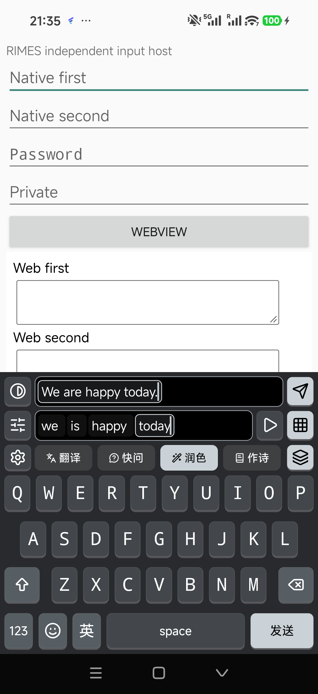

# Android 0.1.0-dev.8 · CometAPI 真机验证

日期：2026-10-03。分支 `codex/android-chinese-input`，基于 `00994612b187572d400267180f0d1fa5fbe0e031` 的本地未提交改动。没有提交、推送或公开发布。

## 结果

在 Android 16 / API 36 真机 `25098PN5AC` 上，CometAPI `deepseek-v4-flash` 的真实快问、润色和翻译，以及手动发送、取消、切换输入框和隐私保护检查通过。

| 场景 | 实际结果 | 测量时间 |
|---|---|---|
| 快问 `why is the sky blue` | 返回解释瑞利散射的真实英文回复 | 4,311 ms |
| 润色 `we is happy today` | `We are happy today.` | 3,094 ms |
| 翻译 `good morning` | `早上好` | 2,875 ms |

时间从点击执行到发送后的检查结束，包含 UI 等待，不是纯模型推理时间或首字延迟。只使用合成测试文本。

## 接入内容

- 主应用 **AI services → CometAPI** 可配置密钥、模型、联网开关及 AI 翻译开关。固定使用 [官方文档](https://apidoc.cometapi.com/) 的 `https://api.cometapi.com/v1/chat/completions`。
- 默认模型 `deepseek-v4-flash`。普通打字与本机词典仍离线，只有主动执行才上传本次 Buffer 原文。画画仍是文字提示词，没有实现图片生成。
- 密钥由 Android Keystore 的 AES-GCM 密钥加密，保存与删除同步落盘；字段不回显、不进入视图保存状态或系统备份。源码和 APK 中没有测试密钥。
- HTTP 错误、地区限制、断流与格式错误保留原文，不回退到模拟内容，不开放发送。只识别允许的错误码，不把服务端错误正文或凭据显示给用户。
- 禁止自动重试与重定向；连接 10 秒、读取 20 秒、总期限 60 秒；取消异步断开请求；输出限制 2,048 tokens / 16,384 UTF-16 单元。配置变更会撤销旧结果。

## 验证

| 层级 | 结果 |
|---|---|
| JVM 核心测试 | 47 项通过 |
| 网络协议、取消与 Keystore | 43 项通过，含 401/403/429/5xx、重定向、错误脱敏、地区限制和取消阻塞读取 |
| 本机插件后端 | 68 项通过 |
| 服务投递和配置变更 | 150 项通过 |
| 原生设置页 | 最终包 381 项通过，含密钥字段、保存、删除和原设置恢复 |
| 真机实际键盘 → 外部原生输入框 | 202 项通过：真实快问/润色/翻译、完成前禁止发送、准确单次发送、取消、换框、隐私与密码框无 AI 操作 |
| 构建、资源验证、lint | 通过；app lint 0 errors / 12 warnings |
| 最终安装包 | 从手机读回的 APK 与本地构建 SHA-256 相同 |

密码框允许系统安全键盘接管；检查聚焦与无 AI 操作，不把其他输入法的键帽当作 RIMES 验收。

初次手机网络不可用；Wi-Fi 重连后，后台测试进程还受到系统联网限制。以实际前台应用请求复核后，CometAPI 返回 `403 / region_restricted`，公开模型目录也返回相同限制，更换 User-Agent 没有改变结果。维护者随后改变手机网络，真实键盘请求成功。没有修改服务商访问策略或降低 TLS 校验。

早期测试工具的几个问题已修正：使用 Android 支持的文件读取 API；独立 UI 自动化会话先关闭；首次点击宿主输入框唤起键盘；密码框允许 OEM 接管。一次按“应拒绝”编写的检查，在网络变化后收到真实成功回复，因此改为成功流程验收。旧失败记录不作为通过证据。

## 包与边界

- 版本 `0.1.0-dev.8` / `versionCode=8`，应用 `org.scholay.rimes.android.debug`。
- APK 大小 `17,549,129` bytes；SHA-256 `d5a083054d0b98297fe32e9ddfcce6f1a6f705bd7c0c6769a29fea34f03ecae2`。
- 使用覆盖安装，没有卸载或清空应用数据。词库目录未被替换。已恢复测试前的键盘偏好与 RIMES 输入法选择；测试密钥已从手机移除，联网 AI 已关闭，Mac 临时明文已删除。可在 AI services → CometAPI 重新配置继续使用。
- [机器可读记录和改动源码指纹](2026-10-03-dev8.json)。最终 APK 位于 `app/build/outputs/apk/debug/app-debug.apk`。
- 本次只覆盖一台 Android 16 手机和一个模型；未新增长时间 soak、最低 Android 8.0、多厂商、其他模型、真实作诗/画画提示词或图片生成验收。
- 仍是 debug 包。正式应用身份、长期签名、升级迁移和更广设备验收仍是 1.0 的后续工作。
